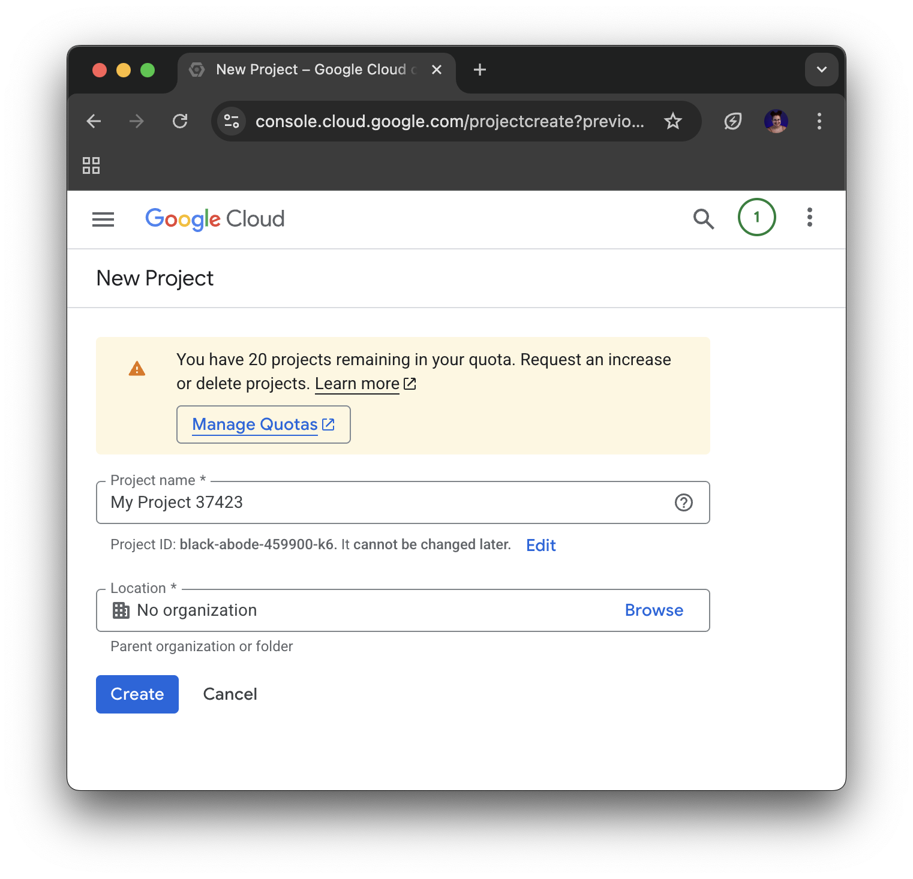
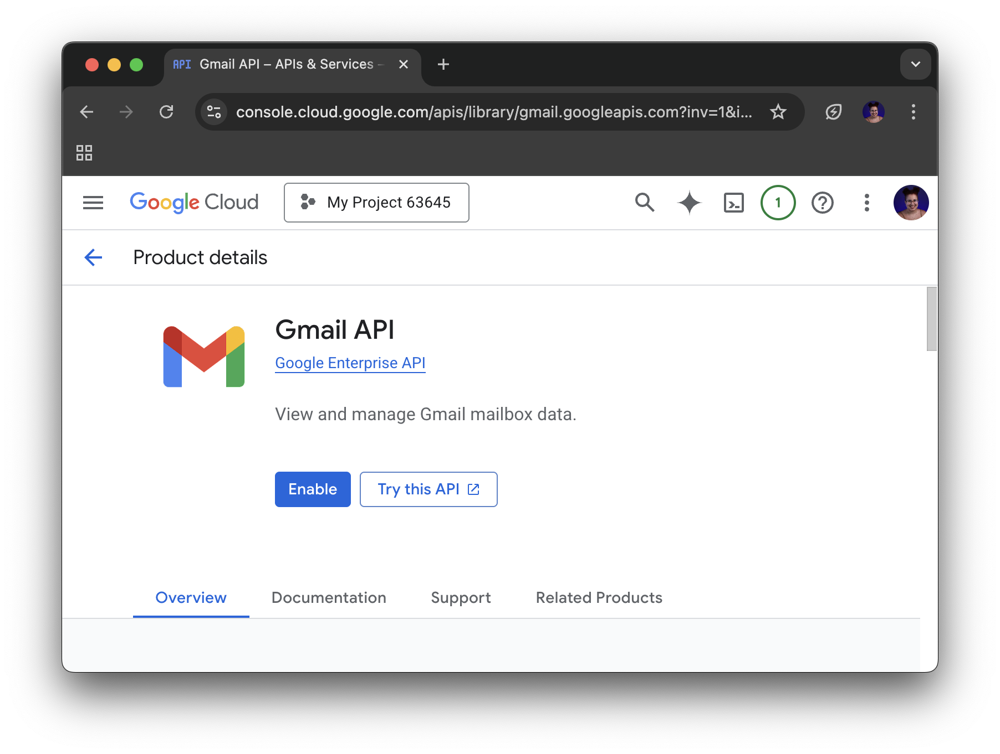
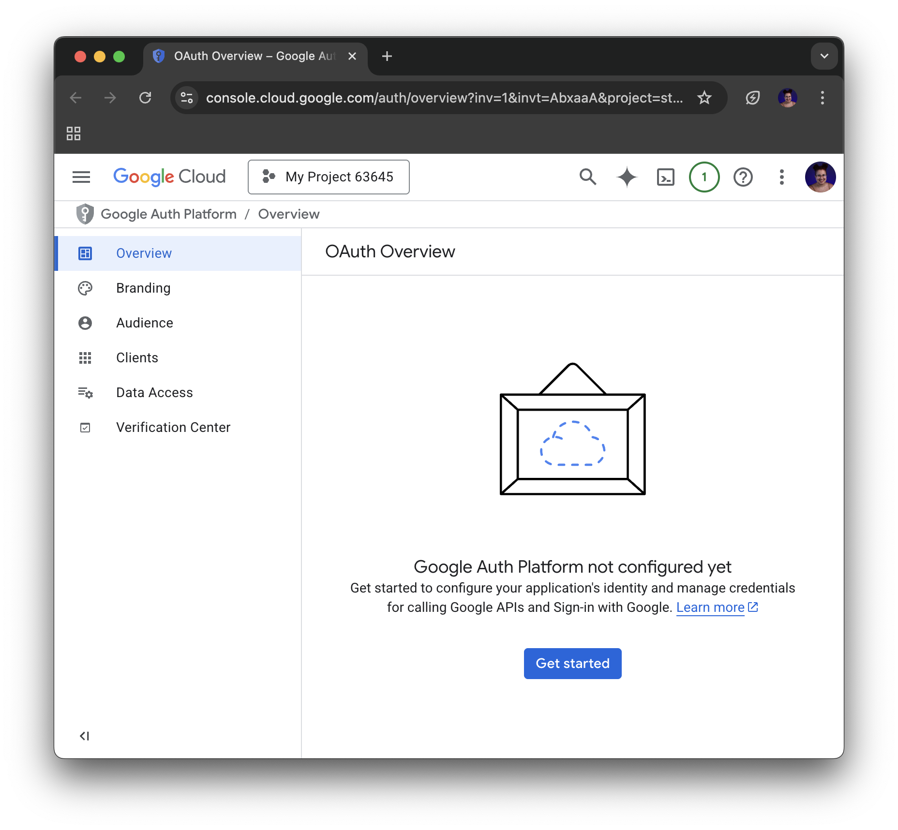
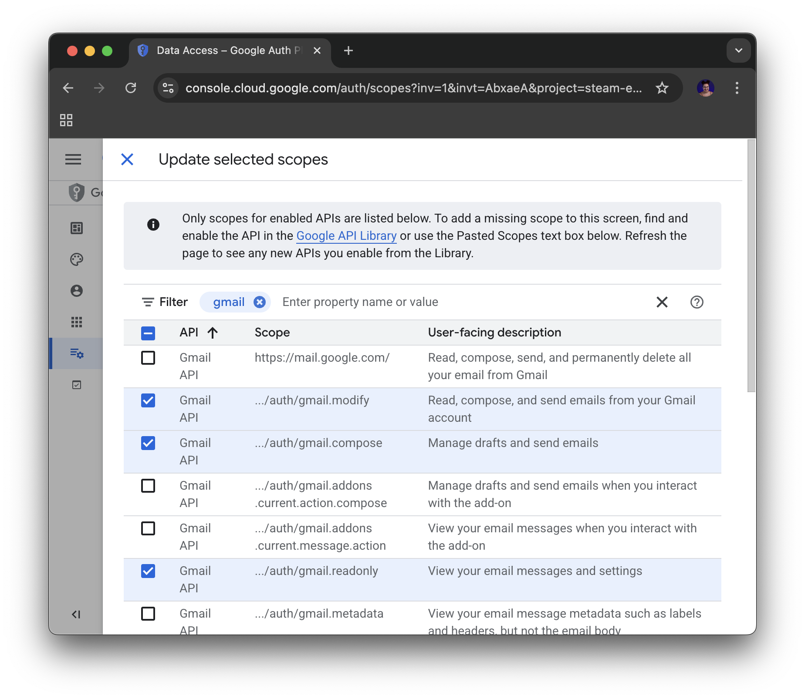
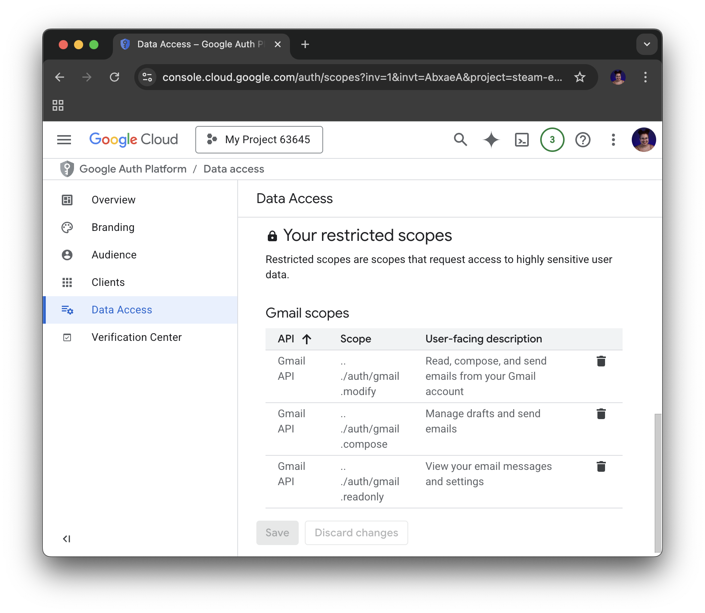
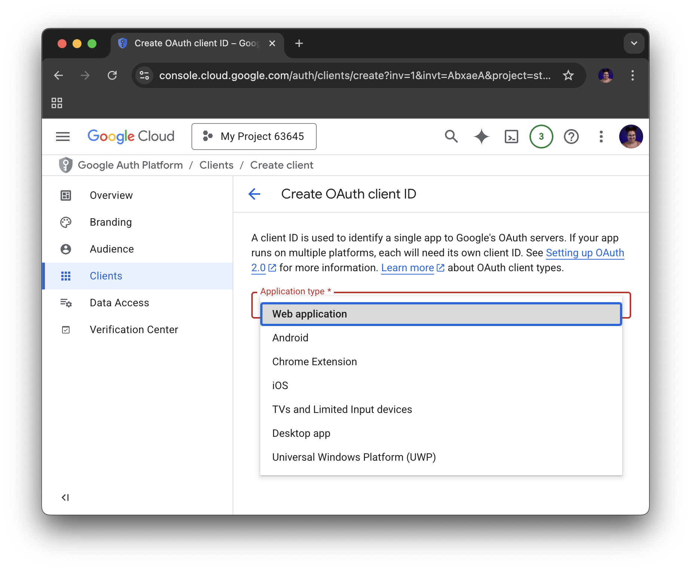
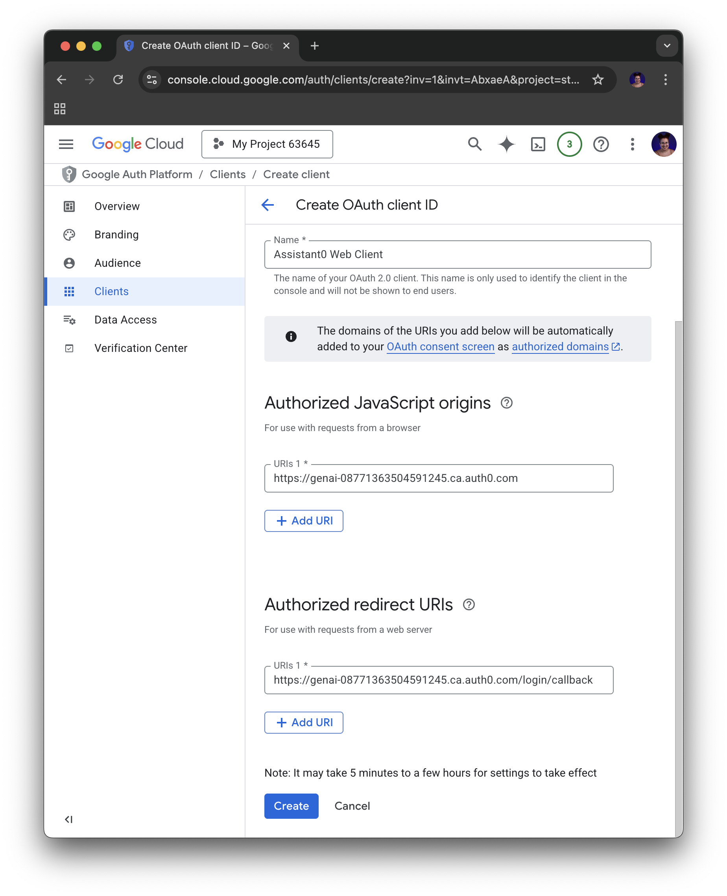
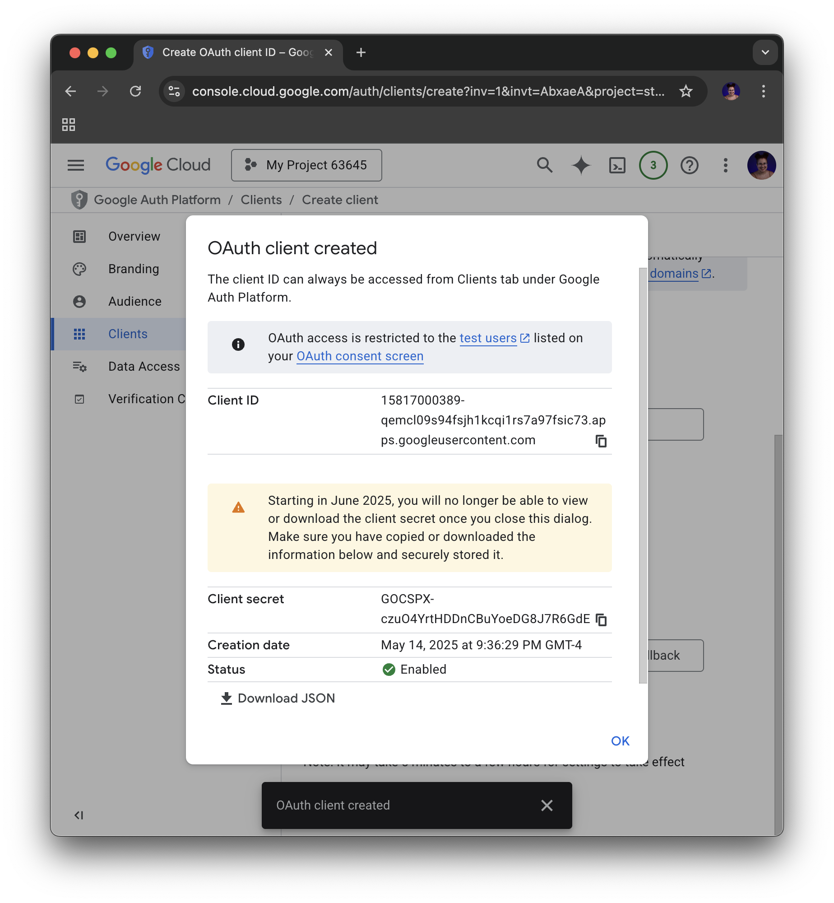

# Setting up a Google project for tool calling

To allow your application to interact with Google services like Gmail, we need to register it with Google and get API credentials.

For this you'll need a [Google Developer Account](https://console.developers.google.com/), a Google project, enable the Gmail API, and configuring an OAuth consent screen and credentials.

You can follow the steps on the [Google Sign-in and Authorization](https://auth0.com/ai/docs/google-sign-in-and-auth) section of the Auth for GenAI Docs.

In case you prefer to follow them here you can use the expandable section below.

Detailed steps

## Setting up a Google Project

First create and setup the Google Project, then enable the Gmail API:

1. Go to [Google Cloud Console](https://console.developers.google.com/) and create a new project or select an existing one.

2. Go to the [Gmail API](https://console.cloud.google.com/apis/library/gmail.googleapis.com) and enable it.
    * Make sure your project is selected at the top left corner

    

Then you need to configure the Application:

1. Go to the [Google Auth Platform](https://console.cloud.google.com/auth/overview) and create the app:

    1. Click **Get Started**
    1. Create an App:
        * **App Name**: dev_day
        * **User support email**: choose your preferred email.
        * Click **Next**
    1. Select your Audience
        * Choose **External**
    1. Set the Contact Information:
        * You can type your email
    1. Finish:
        * Agree and Create

2. Now go to **Branding** on the left hand side menu:
    * Under **Authorized domains**, enter `auth0.com`

3. Go to **Audience** on the left hand side menu:
    * In _Test Users_, you can add the email addresses you want to use for testing.
    * Test users must be valid Gmail Accounts.

4. Finally, on **Data Access** add the GMail scope:
    * Filter for Gmail and select the scopes:
        * `.../auth/gmail.readonly` - to read emails
        * `.../auth/gmail.compose` - to draft and send emails
        * `.../auth/gmail.modify` - for more advanced operations like marking as read

        
    * Scroll to the bottom and click **Update**. 
    * You should see something like this after the update:
    

5. Click **Save**.

Finally is time to setup the OAuth Client in Google:

1. Start copying your Auth0 Domain:
    * Go to the Auth0 Dashboard under your [Tentant Settings](https://manage.auth0.com/#/tenant/general)
    * Copy the tentant name and region 
2. Go to [the Google Auth Platform under the Clients section](https://console.cloud.google.com/auth/clients).
    * Click the three dots and then "**+ Create Client**".
    
    
    * **Application type**: Select "*Web application*".

    
    * **Name**: Give it a name, e.g., "*Assistant0 Web Client*".
    * Authorized JavaScript origins: 
        * Add your **Auth0 Domain**: https://<YOUR_AUTH0_DOMAIN> (e.g., https://your-tenant.region.auth0.com).
    * Authorized redirect URIs:
        * Add your **Auth0 Callback URL**: https://<YOUR_AUTH0_DOMAIN>/login/callback.
    
    
    * Click **Create**.
* You'll now see your **Client ID** and **Client Secret**. Copy these and make sure not to lose them or share them. You'll need them to configure the Google social connection in Auth0.

With these steps, your Google Cloud Project is ready, and you have the Client ID and Secret. Next, we'll configure Auth0.

You'll need the **Client ID** and **Client Secret** from a Google Application and Oauth Client for the next step.

## Configure Google Social Connection in Auth0

Now, let's tell Auth0 how to use the Google credentials you just created.

By default Auth0 uses devlopment keys for the google social connection, so now that you have a "real" one, is time to update that.

1. Go back to the Auth0 Dashboard.
2. Navigate to [Authentication > Social](https://manage.auth0.com/#/connections/social).
3. Click on the **google-oauth2** in the list of social connections.
4. Add the information you have from the Google OAuth Client:
    * **Client ID**: Paste the Client ID from your Google Cloud Project.
    * **Client Secret**: Paste the Client Secret from your Google Cloud Project.
5. In the **Permissions** section find the block corresponding to Gmail:
    * Select `Gmail.readonly` and `Gmail.compose`
6. Scroll down to **Advanced Settings**:
    * Ensure **Token Vault** is _enabled_ - using Auth0's Token Vault feature to allow your backend to call Google APIs on behalf of the user. This is key for our use case with Auth0 for GenAI.
7. Scroll all the way down and click **Save Changes**.

---

With these completed you are ready for [the next step](04-tool-calling-gmail.md).
